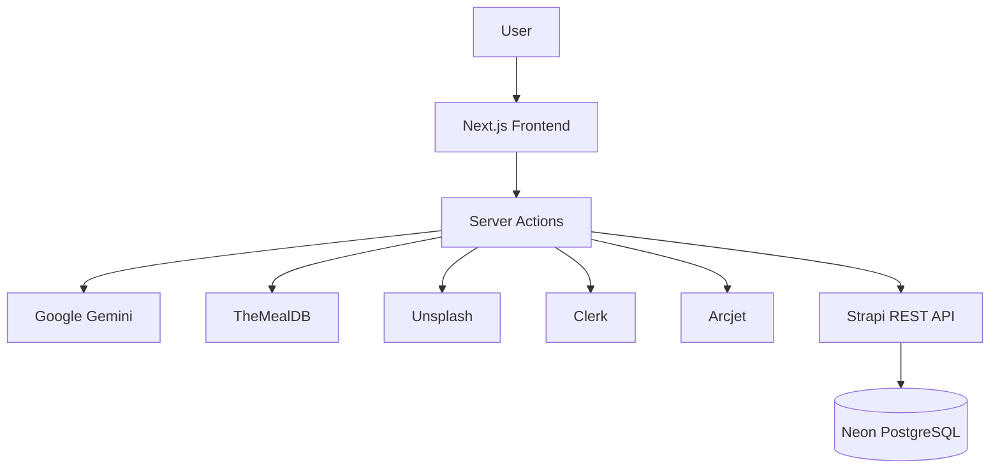

# JugaadChef - AI Recipe Platform

> AI-powered recipe platform that helps you discover, generate, and save recipes in multiple ways.

Search for any recipe and let AI generate a complete recipe, scan your pantry to get recommendations based on available ingredients, or explore recipes across different cuisines and categories. Save recipes you love to build your personal collection.

<div align="center">
  <a href="https://jugaadchef.vercel.app/">
    <strong>🔗 Try JugaadChef Here</strong>
  </a>
</div>

## 1. Project Overview 

JugaadChef is an AI Recipe Platform built as a split full-stack project:

- `frontend` is a Next.js App Router application for UI, routing, Clerk auth, server actions, and AI/external API orchestration.
- `backend` is a Strapi CMS backend that stores structured user, pantry, recipe, and saved-recipe data.

The core experience is simple: users can manage their pantry, scan available ingredients with AI, generate recipe recommendations, explore built-in recipes through cuisines and categories, search for recipes, and save recipes they want to cook later.

Generated recipes are also persisted as public recipes, allowing existing recipes to be reused from the database instead of unnecessarily generating the same recipe again.

## 2. Features

- AI pantry image scanning with Gemini Vision-style prompts to detect ingredients and estimated quantities.
- Pantry item management (add manually, save scanned items, edit, delete, list per user).
- AI recipe recommendations based on the user’s current pantry ingredients.
- Recipe generation from a recipe name with structured output (ingredients, instructions, nutrition, tips, substitutions).
- Quick recipe-name search flow via the `How to Cook?` modal and recipe route query parameter.
- Database-first recipe lookup: checks Strapi for an existing recipe before generating a new one.
- Optional recipe image enrichment via Unsplash during recipe creation.
- Built-in discovery from `TheMealDB`: Recipe of the Day, browse by category, browse by cuisine.
- Recipe detail experience with save/unsave actions for personal collections.
- Saved recipes page as a personal cookbook view.
- Recipe PDF download/export from the recipe detail page.
- `Clerk authentication` with protected route middleware for core cooking routes.
- Subscription-aware behavior (free/pro tier checks from Clerk plan state).
- Rate limiting and token-bucket usage controls for AI scan/recommendation workflows via Arcjet.
- Pro-locked UI sections for advanced recipe metadata (nutrition, chef tips, substitutions).

## 3. Tech Stack

### Frontend

- Next.js (App Router)
- React
- Tailwind CSS
- Shadcn UI
- Server Actions
- React Hooks
- Dynamic Routing
- REST API Integration
- Lucide React, React Dropzone & Spinner

### Backend
- Strapi 5 CMS
- Node.js
- Strapi REST API
- Neon PostgreSQL
- PostgreSQL (`pg`) database driver
- Users & Permissions plugin


### AI & External Services

- Clerk - Authentication and user management
- Google Gemini - AI ingredient recognition and recipe generation
- TheMealDB - Built-in recipe discovery
- Unsplash - Image retrieval for generated recipes
- Arcjet - Rate limiting and application protection

## 4. Architecture Overview



### Core flows

**Pantry Scan**

1. User uploads/captures pantry image.
2. Server action validates auth + usage tier.
3. Gemini extracts ingredient data.
4. User reviews and saves items to Strapi pantry records.

**Pantry to Recipe Recommendations**

1. App loads pantry items for the current user.
2. Server action applies rate limit rules.
3. Gemini returns recipe suggestions with match percentages and missing items.

**Recipe Generation**

1. User enters a dish name (How to Cook modal or recipe route query).
2. App normalizes title and checks Strapi for existing recipe.
3. If missing, Gemini generates structured recipe JSON.
4. Optional image is fetched from Unsplash and recipe is persisted to Strapi.

**Recipe Discovery**

1. Dashboard loads Recipe of the Day, categories, and cuisines from TheMealDB.
2. Users browse category/cuisine grids and open recipe pages.
3. Recipe pages support save/unsave and PDF download.

## 5. Project Structure

```text
JugaadChef
├── frontend/
│   ├── actions/          # Server Actions and application workflows
│   ├── app/              # Next.js routes and pages
│   ├── components/       # Reusable UI components
│   ├── hooks/            # Custom React hooks
│   ├── lib/              # Utilities and shared logic
│   └── public/           # Static assets
│
├── backend/
│   ├── config/           # Strapi 5 configuration
│   ├── database/         # Database configuration
│   ├── public/           # Backend public assets
│   ├── src/              # Strapi APIs and extensions
│
└── README.md
```

## 6. Environment Variables Setup

Create separate env files for frontend and backend.

### Frontend

```env
NEXT_PUBLIC_STRAPI_URL=
STRAPI_API_TOKEN=
GEMINI_API_KEY=
UNSPLASH_ACCESS_KEY=
ARCJET_KEY=
NEXT_PUBLIC_CLERK_PUBLISHABLE_KEY=
CLERK_SECRET_KEY=
```

### Backend (Strapi)

```env

HOST=
PORT=

APP_KEYS=
API_TOKEN_SALT=
ADMIN_JWT_SECRET=
JWT_SECRET=
TRANSFER_TOKEN_SALT=
ENCRYPTION_KEY=

DATABASE_CLIENT=postgres
DATABASE_HOST=
DATABASE_PORT=
DATABASE_NAME=
DATABASE_USERNAME=
DATABASE_PASSWORD=
DATABASE_SSL=true
```

Never commit environment files containing secrets.

## 7. Local Development Setup

### Prerequisites

- Node.js 20+ (backend engines specify >=20)
- npm

### Backend (Strapi 5)

```bash
cd backend
npm install
npm run develop
```

Default local URL: http://localhost:1337

### Frontend (Next.js)

```bash
cd frontend
npm install
npm run dev
```

Default local URL: http://localhost:3000


## 8. Future Improvements

- Strengthen AI response validation with schema-first parsing and fallback retries.
- Add caching/reuse for repeated recipe generation and recommendation prompts.
- Improve personalized recommendations using saved recipes + pantry history signals.
- Expand automated test coverage for server actions and key page flows.
- Add better ingredient confidence editing UX after pantry image scan.
- Optimize Strapi query population patterns for lower response payloads.
